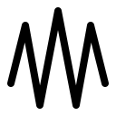

# Forst

Threaded real-time chat inspired by
[heim](https://github.com/euphoria-io/heim/).

## Name and logo

The German word "Forst" describes a type of forest created and managed by humans
(usually for commercial purposes). Often, the trees are planted in neat rows.
The logo is meant to represent the stylized tops of three coniferous trees.
